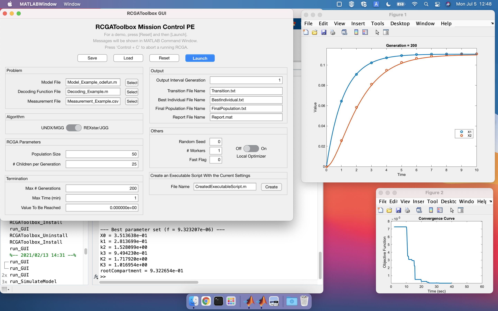

# RCGAToolbox

RCGAToolbox is a MATLAB toolbox that contains two real-coded genetic algorithms (RCGAs): the unimodal normal distribution crossover with minimal generation gap (UNDX/MGG) and the real-coded ensemble crossover star with just generation gap (REXstar/JGG). The stochastic ranking method is implemented to efficiently handle constrained optimization problems. RCGAToolbox not only provides access to RCGAs but also several useful features for parameter estimation in systems biology. For demos, run scripts in `RCGAToolbox/doc/demo`. <a href="https://github.com/kmaeda16/RCGAToolbox/blob/master/doc/RCGAToolbox_UserGuide_v1.4.pdf">User guide</a> can be found in `RCGAToolbox/doc/`. Video tutorials are available on <a href="https://www.youtube.com/playlist?list=PLOpE8E-aX1H8qqWvf1YSoN2nA6O-2wfYA">YouTube</a>.

## License

RCGAToolbox is distributed under GNU General Public License v3.0. For academic usage, RCGAToolbox is free. For other usages, please contact the author(s).
The distribution of RCGAToolbox contains third-party tools, and they have their own licenses.

## Release Notes

- Sep 12 2022: RCGAToolbox-1.5: Designated initial population and early stopping added.
- Aug  4 2021: RCGAToolbox-1.4: GUI version selector function added.
- Jul 27 2021: RCGAToolbox-1.3: Installation script and user guide improved.
- Apr 27 2021: RCGAToolbox-1.2: PEtab support. Friendlier error messages.
- Feb 13 2021: RCGAToolbox-1.1: Bug fix, Improved GUIs, Linux and macOS support.
- Dec  9 2020: RCGAToolbox-1.0.

## Requirements

- <a href="https://www.mathworks.com/products/matlab.html?lang=en">***MATLAB R2016a or later***</a>.
- <a href="https://www.mathworks.com/support/requirements/supported-compilers.html?lang=en">***C compiler compatible with MATLAB***</a>. You can get C compilers at no charge: <a href="https://www.mathworks.com/help/matlab/matlab_external/install-mingw-support-package.html?lang=en">MinGW</a> for Windows, <a href="https://gcc.gnu.org/">GCC</a> for Linux, and <a href="https://apps.apple.com/jp/app/xcode/id497799835?mt=12">Xcode</a> for Mac. To check whether you have a C compiler on your computer, type `mex -setup` in the MATLAB Command Window. If you get a message like `MEX configured to use 'gcc' for C language compilation.`, you already have one. 
- <a href="https://www.mathworks.com/products/parallel-computing.html?lang=en">***Parallel Computing Toolbox***</a> (optional) is required for parallel computation (opts.n_par > 1). It is not required for sequential computation.
- <a href="https://www.mathworks.com/products/optimization.html?lang=en">***Optimization Toolbox***</a> (optional) is required for local optimization using fmincon (opts.local = 1). It is not required if the local optimization function is not used.

The third-party tools, ***IQM Tools***, ***SundialsTB***, and ***libSBML***, are included in the distribution of RCGAToolbox. These tools are used by RCGAToolbox: <a href="https://iqmtools.intiquan.com/">***IQM Tools***</a> are used for SBML and a fast simulation (fast_flag = 2). <a href="https://computing.llnl.gov/projects/sundials/sundials-software">***SundialsTB***</a> is used for a fast simulation with CVODE (fast_flag = 1). <a href="https://sourceforge.net/projects/sbml/files/libsbml/MATLAB Interface/">***libSBML***</a> is required for IQM Tools in Linux and macOS. A C compiler compatible with MATLAB is required to install IQM Tools and SundialsTB.

## Installation
Installation tutorials are available on <a href="https://www.youtube.com/playlist?list=PLOpE8E-aX1H8qqWvf1YSoN2nA6O-2wfYA">YouTube</a>.

1. Download RCGAToolbox from https://github.com/kmaeda16/RCGAToolbox.
2. Place the directory `RCGAToolbox` (or `RCGAToolbox-master`) somewhere favorable (e.g. Documents/MATLAB/).
3. Run the installation script `RCGAToolbox_Install.m` under the directory `RCGAToolbox/install/`. It installs RCGAToolbox core components and necessary third-party tools: IQM Tools, SundialsTB, and libSBML.

## Uninstallation

1. Run the uninstallation script `RCGAToolbox_Uninstall.m` under the directory `RCGAToolbox/install/`.
2. Delete the directory `RCGAToolbox`.

## Confirmed Environments
 We confirmed that RCGAToolbox runs on the following environments. It's likely that RCGAToolbox also works on other environments.

| OS  | MATLAB Version | C Compiler |
| --- | --- | --- |
| Windows 10 (2004) | R2016a | Microsoft Visual C++ 2015 Professional |
| Windows 10 (20H2) | R2021a | Microsoft Visual C++ 2015 Professional |
| Windows 10 (20H2) | R2021a | MinGW |
| SUSE Linux Enterprise Server 11 (x86_64)  | R2016a | GCC 4.7.4 |
| macOS Monterey (Intel) | R2022b | Xcode 14 |
| macOS Big Sur 11.5.1 (Apple silicon) | R2021a | Xcode 12 |

## Troubleshooting

`RCGAToolbox/install/RCGAToolbox_Diagnosis.m` is the self-diagnosis script that checks whether the RCGAToolbox is properly installed. It also tests the RCGAToolbox functions that depend on optional toolboxes. For the diagnosis, run `RCGAToolbox_Diagnosis.m` under the directory `RCGAToolbox/install/`.

## Directories
- `3rdparty`:  Third-party tools (IQMTools, SundialsTB, and libSBML) are contained.
- `doc`: <a href="https://github.com/kmaeda16/RCGAToolbox/blob/master/doc/RCGAToolbox_UserGuide_v1.4.pdf">User guide</a>, demo scripts, and benchmark scripts are contained. For details in the benchmark experiments, see the original article (Maeda et al., 2021).
- `install`: Installation, uninstallation, and diagnosis scripts are contained.
- `source`: Source codes are contained.

## Screenshot

## Citation

If you make use of RCGAToolbox in any publications, we kindly ask that the following paper is cited:

<a href="https://www.jstage.jst.go.jp/article/ipsjtbio/14/0/14_30/_article/-char/en">Kazuhiro Maeda, Fred C. Boogerd, Hiroyuki Kurata, RCGAToolbox: A Real-coded Genetic Algorithm Software for Parameter Estimation of Kinetic Models, IPSJ Transactions on Bioinformatics, Volume 14, Pages 30-35, 2021</a>

-------------------------------
Kazuhiro Maeda (Kyushu Institute of Technology)
